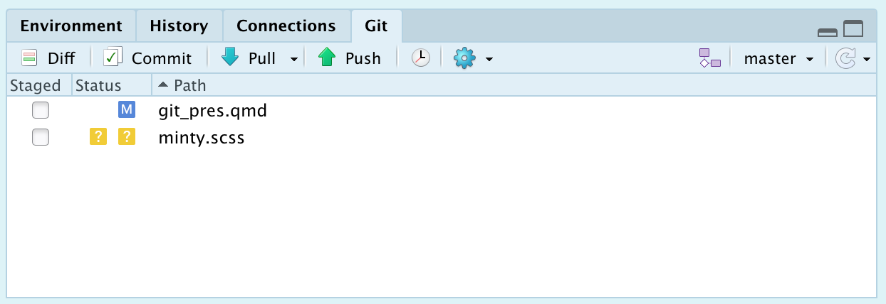
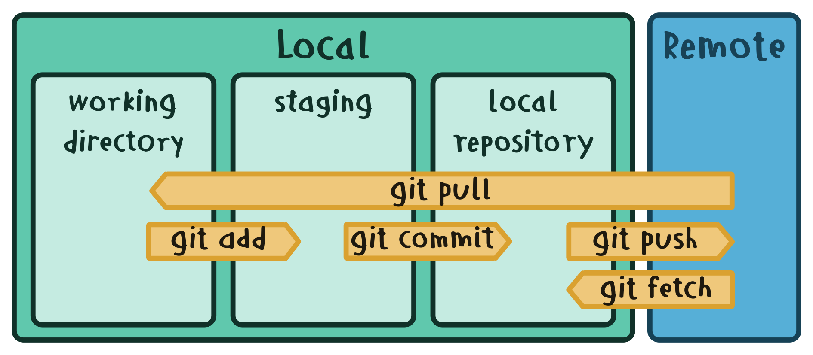

MeetupR Nantes
================

# 

<figure>

<figcaption aria-hidden="true">xkcd comics</figcaption>
</figure>

# Pourquoi utiliser Git?

- A on tous sauvé un fichier `final.R`
- … qu’on a modifié en `final_extra_analysis.R`
- … puis en `final_modif_denis.R` et `final_modif_morgane.R`
- … et on a depuis perdu la trace de la dernière sauvegarde 😐

## Pourquoi utiliser Git?

Un **système de contrôle de version** (SVC) relie et unifie les
différentes versions d’un même projet entre elles.

<figure>

<figcaption aria-hidden="true">atlassian tutorial</figcaption>
</figure>

## Pourquoi utiliser Git?

Un **système de contrôle de version** (SVC) permet de :

- 🧐 garder le fil de ses versions

- ⏳ remonter le temps

- 🤝 collaborer efficacement

- 🔭️ avoir accès à ses projets partout

# Comment utiliser git?

## Comment utiliser git?

✨ utilisable sous RStudio ✨

<figure>

<figcaption aria-hidden="true">git tab in RStudio</figcaption>
</figure>

## Les manoeuvres

<figure>

<figcaption aria-hidden="true">git command (adapted from
C.Staud)</figcaption>
</figure>

## Les manoeuvres locales

Sauvegarder les modifications en **local** :

- `git add` (ou ☑) pour selectionner les modifications à sauver
- `git commit` pour valider la nouvelles version du projet
- 🏁 example

## Les outils

On peut explorer toutes nos modifications :

- **précédentes** avec le `git history` ou `git log`
- **prévue/staged** avec le `git diff`
- 🏁 example

## Les manoeuvres remote

Sauvegarder les modifications en **remote** :

- `git pull` pour récupérer les modifications existantes
- `git push` pour mettre à jour le remote avec notre local
- 🏁 example

🔭 Le repository remote est hébergé en ligne (GitHub, GitLab, Gitea), on
peut le **cloner** sur une autre machine!

# Et les branches?

## Les branches

Une **nouvelle branche** permet de :

- 🧦 créer plusieurs versions à partir d’une même base

- 🚦intégrer des corrections une fois validée/terminée

- 🤝 collaborer efficacement

- 🔭️ et on y a encore accès partout

## Le principe I

On *duplique* une base en un nouvelle branche. Les prochains `commit`
sont spécifiques à la branch active (`git show HEAD`).

<figure>

<figcaption aria-hidden="true">atlassian tutorial</figcaption>
</figure>

## Les manoeuvres

- `git branch <new-branch>` pour créer une branche
- `git checkout <new-branch>` pour la définir comme active
- `git push -–set-upstream` pour ajouter la branch au remote
- 🏁 example

## Le principe II

On *intègre* les `commit` d’une branche dans une autre (`git merge`).

<figure>

<figcaption aria-hidden="true">atlassian tutorial</figcaption>
</figure>

## Les manoeuvres

- `git merge <my_branch>` intègre *my_branch* dans la branche active
- 💡 le `git pull` est un merge entre le remote et le local
- 😈 Un **merge conflict** peut arriver entre `commit`

## Les manoeuvres

En collaboration, on peut créer un `pull request` de notre branch sur un
repo remote pour demander à intégrer nos `commit` dans la master branch.

<figure>

<figcaption aria-hidden="true">atlassian tutorial</figcaption>
</figure>

# 

<figure>

<figcaption aria-hidden="true">xkcd comics</figcaption>
</figure>

# Sources

**git**

profy.dev/project/github-minesweeper/

www.atlassian.com/git/tutorials

**RStudio git**

thinkr.fr/travailler-avec-git-via-rstudio-et-versionner-son-code/

**quarto**

https://quarto.org/docs/presentations/revealjs

github.com/quarto-dev/quarto-cli
